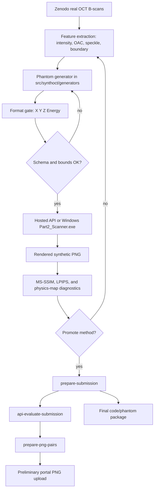

# Submission Guide

The challenge-contract artifact is a scanner-compatible phantom package. The preliminary portal workflow additionally asks for rendered PNG pairs: one synthetic scan rendered from a generated phantom and one matching real reference scan.

## Artifact Types

`synthoct prepare-submission` writes:

- `submission_manifest.csv`: maps each Zenodo reference B-scan to a generated phantom.
- `submission_validation.csv`: schema, row-count, coordinate-bound, and energy-bound checks.
- `SUBMISSION_README.md`: package-local notes.
- `synthoct_<method>_phantoms.zip`: generated `X Y Z Energy` phantom files.
- `synthoct_bibimbap_code_submission.zip`: source package for final code/model review.

For preliminary portal upload, render the phantoms and copy PNG pairs into a clean folder:

- `synthetic_scans/*.png`: scanner-rendered synthetic OCT scans.
- `real_reference_scans/*.png`: matching real reference scans.
- `png_pair_manifest.csv`: pair manifest.

## Smoke Package

Use a small limit before spending API calls on the full set:

```bash
synthoct prepare-submission \
  --zip 18095266.zip \
  --out outputs/submission_ready_smoke \
  --limit 3 \
  --scatterers-count 300000
```

This verifies phantom generation, packaging, and validation CSV creation. Do not upload the phantom zip to the preliminary portal unless the portal explicitly asks for raw phantoms.

## Full Phantom Package

Create one H61 phantom for every PNG B-scan in the Zenodo archive:

```bash
synthoct prepare-submission \
  --zip 18095266.zip \
  --out outputs/submission_ready_h61_full \
  --scatterers-count 300000
```

To package a candidate method explicitly:

```bash
synthoct prepare-submission \
  --zip 18095266.zip \
  --out outputs/submission_ready_h67_10 \
  --method H67_coarse_to_fine_crisp \
  --limit 10 \
  --scatterers-count 300000
```

## API Rendering

Render generated phantoms through the hosted API:

```bash
synthoct api-evaluate-submission \
  --zip 18095266.zip \
  --submission-dir outputs/submission_ready_h61_full \
  --out outputs/api_preliminary_h61 \
  --api-key-file ~/.config/synthoct/api_key
```

Outputs:

- `outputs/api_preliminary_h61/synthetic/*.png`;
- `outputs/api_preliminary_h61/references/*.png`;
- `outputs/api_preliminary_h61/api_metrics.csv`;
- `outputs/api_preliminary_h61/preliminary_upload_plan.csv`.

Omit `--limit` to render every packaged phantom. API keys are resolved from `SYNTHOCT_API_KEY`, `SYNTHOCT_CHALLENGE_API_KEY`, or a local file passed with `--api-key-file`. Do not commit keys or portal credentials.

## Portal PNG Pairs

Copy selected API-rendered pairs into a clean upload folder:

```bash
synthoct prepare-png-pairs \
  --upload-plan outputs/api_preliminary_h61/preliminary_upload_plan.csv \
  --out outputs/preliminary_png_pairs_h61
```

Use `--limit` to copy only the top ranked pairs:

```bash
synthoct prepare-png-pairs \
  --upload-plan outputs/api_preliminary_h61/preliminary_upload_plan.csv \
  --out outputs/preliminary_png_pairs_h61_top5 \
  --limit 5
```

## End-To-End Flow



## Before Upload

1. Confirm the generated phantoms pass `submission_validation.csv`.
2. Use hosted API or Windows scanner-rendered PNGs, not direct image synthesis outputs.
3. Upload one synthetic/reference PNG pair at a time if the portal form is pair-based.
4. Confirm whether repeated pair uploads accumulate or replace prior uploads.
5. Use the final code zip or repository link for final code/model submission.

Primary preliminary method: `H61_api_low_depth_prelim`.

Backup candidates: rerender `H67_coarse_to_fine_crisp`, `H68_layer_map_prior`, or `H11_low_depth_comp` through the hosted API or official Windows scanner before trusting them.
