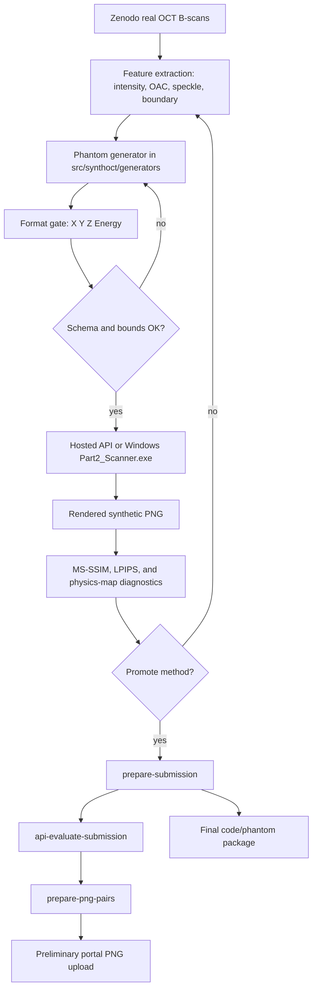

# Submission Guide

The challenge-contract artifact is a scanner-compatible phantom package. The preliminary portal workflow additionally asks for rendered PNG pairs: one synthetic scan rendered from a generated phantom and one matching real reference scan.

## Artifact Types

`synthoct prepare-submission` writes:

- `submission_manifest.csv`: maps each Zenodo reference B-scan to a generated phantom.
- `submission_validation.csv`: schema, row-count, coordinate-bound, and energy-bound checks.
- `SUBMISSION_README.md`: package-local notes.
- `synthoct_<method>_phantoms.zip`: generated `X Y Z Energy` phantom files.
- `synthoct_bibimbap_code_submission.zip`: source package for final code/model review.

For preliminary portal upload, render the phantoms and copy PNG pairs into a clean folder:

- `synthetic_scans/*.png`: scanner-rendered synthetic OCT scans.
- `real_reference_scans/*.png`: matching real reference scans.
- `png_pair_manifest.csv`: pair manifest.

## Smoke Package

Use a small limit before spending API calls on the full set:

```bash
synthoct prepare-submission \
  --zip 18095266.zip \
  --out outputs/submission_ready_smoke \
  --limit 3 \
  --scatterers-count 300000
```

This verifies phantom generation, packaging, and validation CSV creation. Do not upload the phantom zip to the preliminary portal unless the portal explicitly asks for raw phantoms.

## Full Phantom Package

Create one H61 phantom for every PNG B-scan in the Zenodo archive:

```bash
synthoct prepare-submission \
  --zip 18095266.zip \
  --out outputs/submission_ready_h61_full \
  --scatterers-count 300000
```

To package a candidate method explicitly:

```bash
synthoct prepare-submission \
  --zip 18095266.zip \
  --out outputs/submission_ready_h67_10 \
  --method H67_coarse_to_fine_crisp \
  --limit 10 \
  --scatterers-count 300000
```

For a learned-prior candidate, pass the prior artifact so the phantom package and code/model zip remain reproducible:

```bash
synthoct prepare-submission \
  --zip 18095266.zip \
  --out outputs/submission_ready_learned_prior_sparse_p140_t32_full_corrected \
  --method learned-prior-sparse-p140-t32 \
  --learned-prior-artifact outputs/learned_priors/goal_h_candidates_prior.npz \
  --scatterers-count 300000 \
  --evidence-metrics outputs/api_validation_goal_t32_p140_h61_offset1_5x1/challenge_metrics_summary.csv \
  --baseline H61_api_low_depth_prelim \
  --strict-evidence \
  --require-real-lpips \
  --max-generation-seconds 600
```

As of the latest local true-scanner validation, `learned-prior-sparse-p140-t32` is the selected conservative generator candidate. The current evidence file uses real LPIPS, full-frame hosted true-scanner renders, and complete Struct/OAC/SC/RSC map metrics. This remains a local fair-evidence decision, not a hidden-holdout result.

This writes `submission_readiness_report.json` and includes it in the phantom zip. The current corrected full public-set package is `outputs/submission_ready_learned_prior_sparse_p140_t32_full_corrected`: it contains `120` manifest rows, `120` validation rows, and a code zip with `artifacts/goal_h_candidates_prior.npz`. Exact checksums are generated in `outputs/submission_ready_learned_prior_sparse_p140_t32_full_corrected/artifact_manifest.md`; see [final_artifact_manifest.md](final_artifact_manifest.md) for why the exact hashes live outside the code zip. The best measured public-set rescue artifact is `outputs/submission_ready_p140_t32_flow_energy_rank120_adaptive_rank36_patch`, validated at `outputs/api_preliminary_p140_t32_flow_energy_rank120_adaptive_rank36_patch/challenge_metrics_summary.csv`; it improves the public-set floor but is selected from public validation failures, so do not treat it as hidden-holdout proof. Do not upload the older uncorrected `outputs/submission_ready_learned_prior_sparse_p140_t32_full` package; it was generated from incorrectly scaled temporary reference PNGs. Use strict mode after `synthoct select-best --require-real-lpips` has identified the candidate; skip it only for smoke packaging or exploratory bundles. The current official-map summary still warns that the preliminary LPIPS threshold is not fully passed, mainly due to Structural LPIPS.

The corrected preliminary portal pair folder is:

```text
outputs/preliminary_png_pairs_learned_prior_sparse_p140_t32_10_corrected
```

The matching archive is `outputs/preliminary_png_pairs_learned_prior_sparse_p140_t32_10_corrected.zip`.

For an exploratory ML/DL candidate, train a neural phantom prior from existing true-scanner validation rows, validate its generated phantoms through the hosted API, and package it only after it wins the same evidence gate:

```bash
synthoct train-neural-phantom-prior \
  --outputs-dir outputs \
  --out outputs/neural_priors/phantom_field_prior.pt \
  --epochs 80

synthoct validate-internal \
  --zip 18095266.zip \
  --out outputs/api_validation_neural_prior_offset1_5x1 \
  --methods neural-prior learned-prior-sparse-p140-t32 \
  --neural-prior-artifact outputs/neural_priors/phantom_field_prior.pt \
  --learned-prior-artifact outputs/learned_priors/goal_h_candidates_prior.npz \
  --folds 5 \
  --max-per-fold 1 \
  --sample-offset 1 \
  --scatterers-count 300000 \
  --include-lpips \
  --api-key-file ~/.config/synthoct/api_key
```

If `neural-prior` is selected by `synthoct select-best`, package it with `--neural-prior-artifact`. The `.pt` file is copied into `artifacts/` inside the code zip, just like the learned-prior `.npz` artifact. Until that true-scanner validation exists, the neural model is a candidate generator, not a promoted submission.

An exploratory hybrid ML/DL package exists for `hybrid-neural-p140-t32-e20`:

```text
outputs/submission_ready_hybrid_neural_p140_t32_e20_full
```

It includes both `outputs/learned_priors/goal_h_candidates_prior.npz` and `outputs/neural_priors/goal_true_scanner_prior.pt` in the code zip. Broader offset-1 plus offset-2 evidence still favors `learned-prior-sparse-p140-t32`, so this package is useful for follow-up testing rather than conservative final upload.

## API Rendering

Render generated phantoms through the hosted API:

```bash
synthoct api-evaluate-submission \
  --zip 18095266.zip \
  --submission-dir outputs/submission_ready_h61_full \
  --out outputs/api_preliminary_h61 \
  --api-concurrency 2 \
  --progress \
  --api-key-file ~/.config/synthoct/api_key
```

Outputs:

- `outputs/api_preliminary_h61/synthetic/*.png`;
- `outputs/api_preliminary_h61/references/*.png`;
- `outputs/api_preliminary_h61/api_metrics.csv`;
- `outputs/api_preliminary_h61/preliminary_upload_plan.csv`.

Omit `--limit` to render every packaged phantom. Use `--api-concurrency 2` for conservative parallel hosted rendering; a two-job probe, repeated 24-candidate batches, and full 120-pair runs completed successfully, but no public SynthOCT rate-limit policy has been found, so do not assume high concurrency is acceptable. Existing PNGs are reused while `api_metrics.csv` is rewritten in manifest order, making interrupted or expanded runs safe to resume. Candidate queues can use the same setting with `synthoct render-candidate-queue --api-concurrency 2`; include a `reference_png` column for multi-reference queues, otherwise `--ref` is used as the single fallback reference. Candidate queue metrics are flushed as rows finish, and hosted poll failures preserve the request id when one was assigned, so late result recovery is less brittle. API keys are resolved from `SYNTHOCT_API_KEY`, `SYNTHOCT_CHALLENGE_API_KEY`, or a local file passed with `--api-key-file`. Do not commit keys or portal credentials.

For larger rescue sweeps, use the rank-window batch command. It selects public-set rows by low Structural MS-SSIM rank, renders fixed flow phantoms, renders energy-ratio follow-ups, and writes both per-row and summary CSVs:

```bash
synthoct flow-energy-rank-batch \
  --base-api-metrics outputs/api_preliminary_learned_prior_sparse_p140_t32_120_concurrent/api_metrics.csv \
  --out outputs/batch_flow_energy_worst120_rank13_36 \
  --rank-start 13 \
  --rank-end 36 \
  --api-concurrency 2 \
  --poll-interval-seconds 3 \
  --api-key-file ~/.config/synthoct/api_key
```

For adaptive parameter selection against the current best artifact, sweep multiple flow strengths over a weak rank window:

```bash
synthoct adaptive-flow-strength-batch \
  --current-api-metrics outputs/api_preliminary_p140_t32_flow_energy_rank120_adaptive_weak12_patch/api_metrics.csv \
  --out outputs/adaptive_flow_strength_rank13_36_from_adaptive \
  --rank-start 13 \
  --rank-end 36 \
  --strengths 0.12 0.38 \
  --api-concurrency 2 \
  --poll-interval-seconds 3 \
  --api-key-file ~/.config/synthoct/api_key
```

## Portal PNG Pairs

Copy selected API-rendered pairs into a clean upload folder:

```bash
synthoct prepare-png-pairs \
  --upload-plan outputs/api_preliminary_h61/preliminary_upload_plan.csv \
  --out outputs/preliminary_png_pairs_h61
```

Use `--limit` to copy only the top ranked pairs:

```bash
synthoct prepare-png-pairs \
  --upload-plan outputs/api_preliminary_h61/preliminary_upload_plan.csv \
  --out outputs/preliminary_png_pairs_h61_top5 \
  --limit 5
```

## End-To-End Flow



## Before Upload

1. Confirm the generated phantoms pass `submission_validation.csv`.
2. Confirm local evidence and packaging readiness with:

```bash
synthoct challenge-readiness \
  --metrics outputs/api_validation/challenge_metrics_summary.csv \
  --baseline H61_api_low_depth_prelim \
  --method H_new_candidate \
  --submission-dir outputs/submission_ready_selected \
  --strict \
  --max-generation-seconds 600
```

3. Confirm `submission_readiness_report.json` is `ready` for the final method.
4. Use hosted API or Windows scanner-rendered PNGs, not direct image synthesis outputs.
5. Upload one synthetic/reference PNG pair at a time if the portal form is pair-based.
6. Confirm whether repeated pair uploads accumulate or replace prior uploads.
7. Use the final code zip or repository link for final code/model submission.

Primary conservative generator candidate: `learned-prior-sparse-p140-t32`.

Best measured public-set rescue artifact: `outputs/submission_ready_p140_t32_flow_energy_rank120_adaptive_rank36_patch`.

Fallback candidate: rerender `H61_api_low_depth_prelim` through the hosted API or official Windows scanner if learned-prior evidence or packaging fails.
