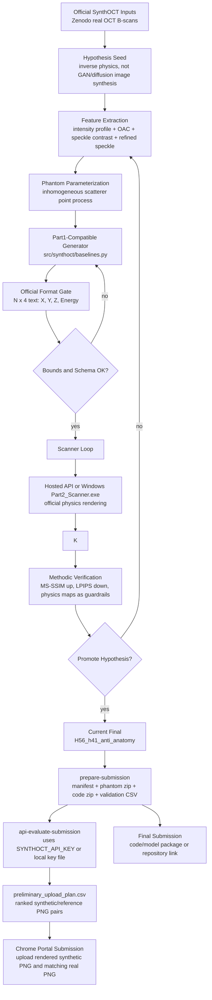

# SynthOCT Hypothesis and Submission Flow

This project stays aligned with the official `SynthOCTChallenge/SynthOCT_Baseline` contract:

- `Part1_Generator.py` maps to `synthoct baseline final` and emits digital phantoms.
- `Part2_Scanner.exe` maps to `synthoct scan --mode real` on Windows or the hosted scanner API.
- `Part3_Processor.py` maps to `synthoct evaluate --maps --metrics` and the internal validation map stack.
- The deliverable remains a four-column scatterer table: `X | Y | Z | Energy`.



## Promotion Rules

1. A hypothesis must output scanner-compatible scatterers, not a direct synthetic image.
2. Every phantom must pass local format validation before API rendering.
3. Ranking must use hosted API or Windows `Part2_Scanner.exe` renders.
4. OAC/SC/RSC are guardrails even when the leaderboard emphasizes MS-SSIM and LPIPS.
5. Runtime must stay below 600 seconds per B-scan on the challenge hardware target.

## Command Pipeline

```bash
synthoct prepare-submission \
  --zip 18095266.zip \
  --out outputs/submission_ready_h56_full \
  --scatterers-count 300000
```

```bash
synthoct api-evaluate-submission \
  --zip 18095266.zip \
  --submission-dir outputs/submission_ready_h56_full \
  --out outputs/api_preliminary_h56 \
  --api-key-file ~/.config/synthoct/api_key
```

```bash
synthoct prepare-upload-plan \
  --api-results outputs/api_preliminary_h56/api_metrics.csv \
  --out outputs/api_preliminary_h56/preliminary_upload_plan.csv
```
